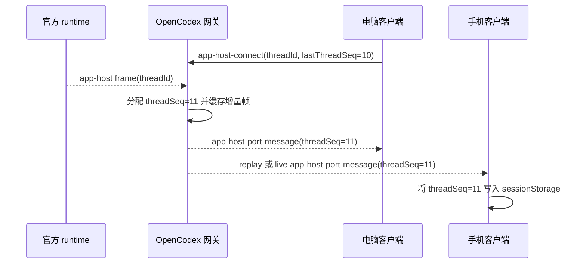
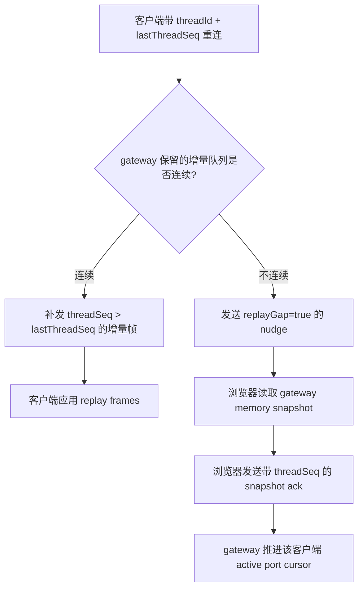

# OpenCodex 多端状态同步架构

这份文档说明 OpenCodex 在电脑浏览器、手机浏览器和其它远端客户端同时访问同一个 Codex 会话时，如何避免退化成“远程桌面式全量透传”，如何在弱网和丢包后补齐状态，以及哪些能力应复用成熟传输层，哪些能力必须由 OpenCodex 自己维护。

## 目标

- 多个客户端打开同一个 thread 时，各自拥有独立的连接状态、快照水位和增量游标。
- 手机后台恢复、弱网重连或临时丢包后，优先补增量；增量不连续时再走全量快照修复。
- gateway 维护 thread 级全量快照和 app-host 增量日志，不要求每次重连都重新向官方 runtime 拉完整状态。
- 传输层优先复用 Socket.IO，OpenCodex 只保留 Codex 私有协议适配。

## 分层职责

| 层级 | 负责内容 | 不负责内容 |
| --- | --- | --- |
| Socket.IO | 连接生命周期、ping/pong、自动重连、短断线包恢复、client/thread room 定向投递 | 理解 `thread/read`、app-host MessagePort、快照语义 |
| raw `/ws` 回退 | Socket.IO 脚本或握手失败时兜底 | 长期主路径优化 |
| OpenCodex gateway | `threadSeq`、全量快照、增量队列、per-client 水位、gap 判断、relay 重建 | 替代官方 Codex runtime |
| 浏览器 polyfill | 优先连接 Socket.IO、保存本标签页 thread 游标、消费快照并 ack | 跨标签页共享私有状态 |
| 官方 runtime | 官方真实会话读写、模型调用、工具状态 | 远端弱网补偿 |

## 可复用开源组件映射

这些能力并不是都要手搓。更合理的边界是：OpenCodex 负责把官方 Codex 私有协议翻译成标准同步模型，底层同步机制尽量复用成熟项目。

| 当前概念 | 通用抽象 | 可复用项目 | 适配方式 |
| --- | --- | --- | --- |
| `threadSeq` | stream sequence / logical clock | Socket.IO packet recovery、NATS JetStream、Yjs state vector | 当前短期用内存 seq；后续可以把 app-host 增量抽象成 stream event |
| 全量快照 | snapshot / compaction / materialized view | Yjs snapshot/update、Replicache pull response、事件溯源 snapshot | gateway 仍生成 Codex thread 快照，但快照存储和 compaction 可复用成熟模式 |
| 增量队列 | event log / retained packets / update log | Socket.IO connection state recovery、NATS JetStream、Yjs updates | 短断线优先 Socket.IO；更长窗口可考虑持久化 event log |
| per-client 水位 | consumer offset / state vector / client cookie | JetStream consumer ack floor、Replicache client cookie、Yjs state vector | 现在是 `snapshotAckThreadSeqByClientId` 和 `threadCursor`；后续可收敛成标准 offset 表 |
| gap 判断 | diff availability / missing update detection | Yjs state vector diff、Replicache pull cookie、stream oldest/latest seq | 当前用 `oldestThreadSeq > cursor + 1`；后续可封装为通用 diff/gap detector |
| relay 重建 | resource lifecycle / actor state machine | XState、Socket.IO rooms、actor model | relay 创建/关闭/重建可以用状态机表达，避免 scattered if/else |

### 选型判断

- Socket.IO 已经适合接管连接恢复、短期 missed packets、room、ack 和广播，不应该继续手写传输层。
- Yjs/Automerge 适合“我们拥有数据结构”的协同文档；Codex thread 可以借鉴 state vector 和 update log，但不能直接把官方 app-host RPC 当成 Yjs 文档。
- Replicache/Electric/PowerSync 适合本地优先数据库同步；如果未来把 thread 列表、消息可见视图做成独立本地数据库，可以复用这类 pull/push/cookie 协议。
- NATS JetStream 适合把 app-host 增量变成持久 event stream，天然有 stream seq、consumer ack 和 redelivery；但引入服务组件较重，适合多机器/长期运行阶段。
- XState 适合 relay 生命周期和恢复决策状态机，不负责数据同步本身。

### 推荐演进顺序

1. 继续用 Socket.IO 做默认传输，补齐 transport recovery 诊断。
2. 把 OpenCodex 当前的 `threadSeq + queue + cursor + gap` 抽成一个小的 `ThreadEventLog` 接口。
3. 先提供内存实现，后续再评估替换为 JetStream、SQLite event log 或其它 stream store。
4. 把 snapshot repair 决策抽成状态机，避免浏览器和 gateway 各自散落判断。
5. 如果未来把 thread 可见状态落成本地数据库，再评估 Replicache/Electric 这类 local-first sync。

## 当前传输路径

浏览器默认路径：

```text
浏览器 polyfill
  -> 加载 /socket.io/socket.io.js
  -> io(location.origin, { path: "/socket.io", transports: ["websocket"] })
  -> emit("message", JSON.stringify(payload))
  -> gateway Socket.IO 适配器
  -> 既有 ws-hub JSON handler
```

失败回退路径：

```text
浏览器 polyfill
  -> Socket.IO 脚本加载失败或握手失败
  -> new WebSocket("/ws")
  -> 既有 ws-hub JSON handler
```

无论使用 Socket.IO 还是 raw WebSocket，业务 payload 都保持一致：

- `hello`
- `ipc-invoke`
- `app-host-connect`
- `app-host-port-message`
- `opencodex:fast-sync-snapshot-ack`
- `client-diagnostic`

这样传输层可以继续演进，而 app-host、IPC、快照补偿逻辑不会分叉。

## 核心水位

| 字段 | 所属端 | 含义 |
| --- | --- | --- |
| `threadSeq` | gateway | gateway 观察到的某个 thread 下 app-host 下行增量序号 |
| `lastThreadSeq` | browser -> gateway | 浏览器端口上报自己已经消费到哪个 thread seq |
| `threadCursor` | gateway diagnostics | gateway 认为某客户端端口已投递到的 seq |
| snapshot 里的 `threadSeq` | gateway snapshot | 该全量快照覆盖到的 app-host seq |
| `snapshotAckThreadSeq` | browser -> gateway | 浏览器确认自己已消费某个全量快照 |
| `snapshotAckThreadSeqByClientId` | gateway diagnostics | 每个客户端自己的快照消费水位 |

`lastSnapshotAckThreadSeq` 只表示最近一次 ack 事件，不能用它判断其它客户端是否落后。

## 正常同步流程



## 弱网恢复流程



## 快照补偿

gateway 为 `thread/read` 和 `thread/turns/list` 保存进程内快照：

```json
{
  "method": "thread/read",
  "threadId": "thread-1",
  "threadSeq": 42,
  "source": "gateway-memory",
  "value": {}
}
```

浏览器消费后发送 ack：

```json
{
  "type": "opencodex:fast-sync-snapshot-ack",
  "clientId": "client-phone",
  "threadId": "thread-1",
  "method": "thread/read",
  "source": "gateway-memory",
  "threadSeq": 42
}
```

gateway 收到 ack 后：

- 更新 `snapshotAckThreadSeqByClientId[clientId]`。
- 将该客户端当前 active app-host ports 的 replay cursor 推进到 `threadSeq`。
- 后续 nudge 只补 `threadSeq` 之后的增量。

## 诊断接口

`GET /api/diagnostics/threads?threadId=<id>` 应重点看：

```json
{
  "latestKnownThreadSeq": 45,
  "oldestThreadSeq": 39,
  "clientWatermarks": [
    {
      "clientId": "client-desktop",
      "portIds": ["port-a"],
      "threadCursor": 45,
      "snapshotAckThreadSeq": 42
    },
    {
      "clientId": "client-phone",
      "portIds": ["port-b"],
      "threadCursor": 40,
      "snapshotAckThreadSeq": 0
    }
  ],
  "snapshotAckThreadSeqByClientId": {
    "client-desktop": 42
  }
}
```

判断方式：

- `latestKnownThreadSeq === threadCursor`：该客户端已追到最新。
- `latestKnownThreadSeq > threadCursor` 且 retained queue 连续：应该补增量。
- `latestKnownThreadSeq > threadCursor` 且 `oldestThreadSeq > threadCursor + 1`：必须快照修复。
- `snapshotAckThreadSeq > 0` 但 `threadCursor` 更低：说明 ack 后 active port cursor 推进可能有问题。

## 已落地能力

- Socket.IO server 与 raw `/ws` 并行。
- 浏览器默认优先 Socket.IO client，失败回退 raw `/ws`。
- Socket.IO adapter 复用既有 JSON 协议和 `ws-hub` handler。
- Socket.IO 客户端加入 `client:<clientId>` 和 `thread:<threadId>` room；非 replay thread nudge 通过 room 定向投递，同步保留 raw `/ws` fallback。
- app-host thread replay queue 与 `threadSeq`。
- 浏览器 `sessionStorage` 保存每个 thread 的 `lastThreadSeq`。
- memory snapshot 携带 `threadSeq`。
- 浏览器 snapshot ack 携带 `threadSeq`。
- gateway 按 client 保存 `snapshotAckThreadSeqByClientId`。
- diagnostics 暴露 `clientWatermarks`。

## 下一步

1. 增加端到端弱网恢复脚本：高延迟、随机断线、乱序 reconnect、多客户端同 thread。
2. 补齐 Socket.IO recovery 与 OpenCodex repair 的关联诊断：`missedByTransport`、`repairedByThreadReplay`、`repairedBySnapshot`。
3. 增加浏览器端真实集成测试：Socket.IO 主路径、脚本加载失败回退、握手失败回退。
4. 在诊断面板展示 per-client watermarks，而不是只在 JSON API 里可见。
5. 评估更长窗口的持久 event log：SQLite event log、JetStream 或其它 stream store。

## 验收标准

- 手机后台 30 秒后回到同一 thread，不刷新页面也能继续显示最新会话状态。
- 两个客户端同开一个 thread，A 发送消息后 B 不需要发一条消息才能看到历史更新。
- replay queue 连续时，B 只收到缺失增量，不重新拉完整 thread。
- replay queue 不连续时，B 读取 gateway memory snapshot，并发送 snapshot ack。
- diagnostics 中每个客户端的 `threadCursor` 和 `snapshotAckThreadSeq` 能解释当前 UI 是否落后。
